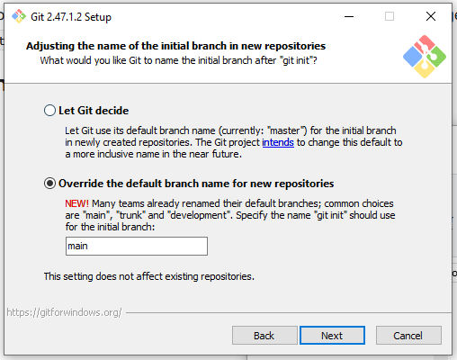

# Instalando os softwares no seu computador

## Windows

### 1. Editor de texto

Baixe e instale um editor de texto, como
[VSCode](https://code.visualstudio.com/) ou
[Notepad++](https://notepad-plus-plus.org/).
Utilize o que achar melhor. Durante o curso utilizaremos o Notepad++ pois
é simples e já está instalado nos computadores da sala.
**Instale o editor de texto primeiro!**

### 2. Git e um terminal

1. Baixe o [Git for Windows](https://gitforwindows.org/). Ele te dará um
   terminal com Bash e Git instalados.
1. Durante a instalação, siga os passos com a configuração padrão **exceto**:
    1. Na parte "Choosing the default editor used by Git": Selecione o seu
       editor de texto no menu.

       

    1. Na parte "Adjusting the name of the initial branch in new repositories":
       Selecione "Override the default branch name for new repositories"

       

    1. Na parte "Configuring the terminal emulator to use with Git Bash":
       Selecione "Use Windows' default console window"

       

Ao final, você terá acesso ao programa "Git Bash" que te fornecerá um terminal
com a linguagem Bash e o programa Git instalado.

### 3. Miniforge

1. Baixe o [Miniforge](https://conda-forge.org/download/) para Windows.
1. Durante a instalação, siga os passos com a configuração padrão **exceto**:
    1. Na parte "Advanced installation options": Selecione "Add Miniforge3 to
       my PATH environment variable".

       

Ao final, você poderá usar os comandos `python` e `conda` no terminal do Git
Bash.

### 4. Make, Tectonic e outros

1. Abra o Git Bash.
1. Digite `conda install -y make tectonic numpy pandas matplotlib` e aperte
   *Enter*.
   Isso deve baixar e instalar o programa `make`, o Tectonic e as bibliotecas
   de Python que iremos utilizar.

## Linux

Na maioria dos sistemas Linux você já terá um terminal com Bash, `make` e o Git
instalados. Caso seja necessário, instale um editor de texto também, embora
a maioria das distribuições já venha com um.

1. Baixe e instale o [Miniforge](https://github.com/conda-forge/miniforge). Ele
   te dará o Python e o gerenciador de software `conda` que utilizaremos para
   instalar o LaTeX. Siga os passos do instalador para colocar as coisas no seu
   `PATH`.
1. Rode o comando `conda install -y tectonic numpy pandas matplotlib` no
   terminal após instalar o Miniforge.
   Isso deve baixar e instalar o Tectonic e as bibliotecas de Python que iremos
   utilizar.

