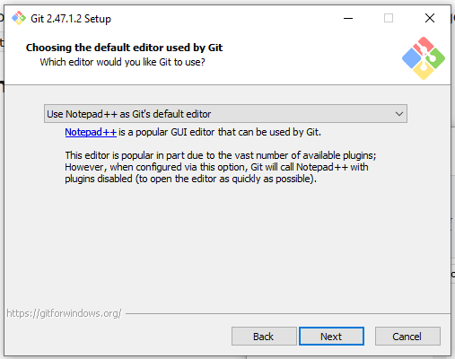
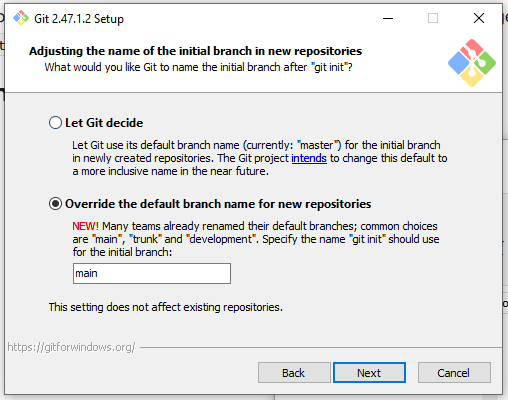
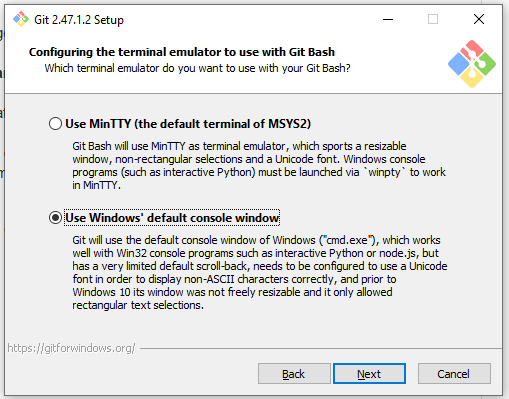
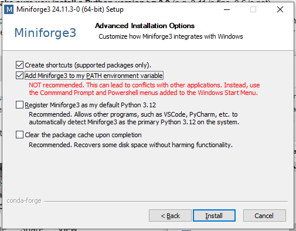

# Kit de sobrevivência digital para cientistas

Minicurso (15h) mininstrado na XXVII Escola de Verão de Geofísica do
[IAG - USP](https://www.iag.usp.br/).

**Instrutor:**
[Leonardo Uieda](https://www.leouieda.com/)

**Monitores:**
[Arthur Siqueira de Macêdo](https://github.com/arthursmacedo),
[Yago Moreira Castro](https://github.com/YagoMCastro)

**Inscrições até 25/11/2024:**
https://www.iag.usp.br/eventos/curso-extensao-escola-verao-2025

## Objetivos

Ensinar noções básicas de diversas ferramentas digitais (shell/bash, git,
GitHub, make, LaTeX) que podem poupar esforços e frustrações de pesquisadores,
alunos e profissionais que lidam com dados (amplamente definido), além de
potencializar sua produtividade e a robustez de seus fluxos de trabalho e lhes
permitir colaborar em projetos de software livre desenvolvidos pela comunidade.

## Prerequisitos

Este curso tem como público alvo graduandos, pós-graduandos, pós-doutorandos
e profissionais atuantes das áreas de Geofísica, Geologia, Meteorologia,
Astronomia ou outras áreas correlatas das Ciências Exatas. Assim, os
prerequisitos são:

* **Conhecimento básico de programação** (de preferência na linguagem Python):
  variáveis, funções, loops, criar gráficos. Os exemplos dados em aula
  utilizarão scripts e notebooks em Python mas não serão o foco das aulas.
* **Conhecimento básico de análise de dados**: regressão linear, médias, desvio
  padrão. Os exemplos dados em aula utilizarão alguns desses conceitos mas eles
  não serão o foco das aulas.

## Ementa

O curso tem como objetivo difundir o uso de algumas ferramentas computacionais
que têm o potencial de facilitar a vida de profissionais e cientistas que lidam
com dados e produção de textos técnicos e científicos. As ferramentas podem ser
utilizadas em diversos contextos: profissional, ensino, estudos, pesquisa,
extensão, etc.

O programa do curso será:

1. **Uso do terminal e de shell scripts:** Em qualquer sistema operacional,
   aprender a utilizar o terminal pode parecer arcaico mas pode ser
   extremamente eficaz para executar tarefas repetitivas e automatizar
   conjuntos de operações que são feitas com frequência. Aprender a navegar em
   um terminal e utilizar a linguagem Bash abrem portas para várias outras
   ferramentas úteis.
2. **Controle de versão e colaboração online com git e GitHub:** Sistemas de
   controle de versão, como o git, servem para rastrear mudanças feitas
   a conjuntos de arquivos. Se utilizadas de maneira correta, podem fornecer
   fontes de backup e a segurança para alterar o conteúdo de arquivos sem
   o medo de perder a versão original. Pareados com plataformas online, como
   o GitHub e GitLab, o uso desses sistemas permite a colaboração em projetos
   de software, websites e até mesmo artigos, livros e teses.
3. **Automatização de workflows com Make:** O programa Make é amplamente
   utilizado desde a década de 70 para automatizar fluxos de trabalho. O uso
   mais comum é para a compilação de códigos complexos, mas seu uso vai muito
   além disso. Com o Make, é possível automatizar tarefas comuns, como rodar
   scripts para produzir figuras, criar PDFs a partir de código LaTeX, etc.
4. **Criação de artigos, livros e teses com LaTeX:** O LaTeX é um "typesetting
   system", que transforma código em PDFs. Embora seja mais trabalhoso de
   aprender do que softwares como Word, o fato do texto ser escrito em forma de
   código possui diversas vantagens: o mesmo texto pode ser usado para gerar
   documentos com temas diferentes, facilidade na utilização de referências
   cruzadas, geração automática de bibliografia e citações, numeração
   automática de equações, figuras e capítulos, etc.

O formato do curso conterá:

* **Aulas expositivas:** Para ensinar uma ferramenta nova, o ministrante
  realizará uma demonstração ao vivo com os participantes seguindo em seus
  próprios computadores.
* **Exercícios:** Intercalado com as aulas expositivas, os participantes
  receberão pequenos desafios e exercícios para serem realizados
  individualmente e em grupos.
* **Aplicações:** O curso reservará parte do tempo para a aplicação das
  ferramentas ensinadas em problemas trazidos pelos participantes. Essas
  aplicações podem ser individuais ou compartilhadas com todos os
  participantes.

Ao final do curso, os participantes saberão como desenvolver projetos complexos
em equipe e com fluxos de trabalho automatizados para produção de resultados
e relatórios/teses/artigos de alta qualidade. As ferramentas aprendidas também
formam a base para melhorar a reprodutibilidade de resultados e para a prática
de Ciência Aberta.

## Cronograma

> O cronograma a seguir é um **esboço** e está **sujeito a mudanças** até a data do curso.

### Dia 1 - O terminal e scripts em Bash

* Introdução ao curso
* O terminal e a linguagem Bash
* Navegando pelo terminal: Diretórios, caminhos, e arquivos (comandos `cd`, `ls`, `pwd`)
* Manipulando arquivos e diretórios (comandos `cp`, `mkdir`, `mv`, `rm` e uso de wildcards)
* Redirecionamento de saída e entrada (comandos `cat`, `wc`, `head`, `sort`)
* Loops com `for`
* Exemplo: Calculando o número de dados em cada arquivo e rodando a análise em todos os arquivos.

### Dia 2 - Controle de versão com git e GitHub

### Dia 3 - Automatização de tarefas com GNU Make

### Dia 4 - Escrita científica com LaTeX

### Dia 5 - Projetos individuais

O último dia estará reservado para que participantes tragam seus próprios
projetos (artigos, dissertações, monografias, etc) aos quais desejem aplicar os
conhecimentos adquiridos ao longo do curso. O instrutor e os monitores
auxiliarão na implementação. Participantes que não tiverem projetos podem
auxiliar em projetos de outras pessoas ou o instrutor pode sugerir algum
projeto.

## Bibliografia

O material abaixo complementa e expande o que veremos em aula. Recomendamos que
todos leiam o material antes das aulas e que os estudem a fundo depois das
aulas para fixar o conteúdo.

* [Lição de Python do Software Carpentry](https://swcarpentry.github.io/python-novice-inflammation)
* [Lição de bash e terminal do Software Carpentry](https://swcarpentry.github.io/shell-novice)
* [Lição de Make do Software Carpentry](https://swcarpentry.github.io/make-novice)
* [Lição de git do Software Carpentry](https://swcarpentry.github.io/git-novice)
* [Documentação de LaTeX do Overleaf](https://www.overleaf.com/learn)

Além disso, aqui estão mais alguns links para videos e exemplos que vão te
ajudar no dia-a-dia de um cientista digital:

* [How to name files - Jennifer Bryan](https://www.youtube.com/watch?v=ES1LTlnpLMk).
  Provavelmente o vídeo mais útil já feito para qualquer pessoa que trabalha
  com dados. Vários outros videos da [NormConf](https://www.youtube.com/@normconf)
  valem a pena também.
* [Pooch](https://www.fatiando.org/pooch/latest/). Ferramenta em Python para
  baixar dados. Muito útil para lidar com workflows envolvendo dados públicos.
* [Exemplo de artigo feito nos modelos do curso](https://github.com/compgeolab/euler-inversion).
  Infelizmente, esse artigo usava Jupyter notebooks e eles não funcionam bem
  com o Make (Leo: Sinceramente, provavelmente vou voltar para scripts `.py` no
  próximo artigo mesmo depois de 13 anos com o Jupyter). Feito com base no
  [template de artigos do CompGeoLab](https://github.com/compgeolab/paper-template).
* [Exemplo de tese feita em LaTeX](https://github.com/santisoler/phd-thesis).
  Tese do [Santiago Soler](https://www.santisoler.com/) com ótimo design
  e várias boas práticas de LaTeX.
* [Exemplo de memorial acadêmico para concurso feito em LaTeX](https://github.com/leouieda/memorial2023).
  Memorial escrito pelo Leo para o concurso de professor do IAG em 2023.
  Utiliza estilo customizado com detalhes gráficos.
* [Exemplo de CV feito em LaTeX](https://github.com/leouieda/cv).
  Currículo resumido do Leo em formato relativamente simples e limpo.
* [Template para projetos de pesquisa em LaTeX](https://github.com/compgeolab/grant-fapesp-template).
  Baseada no modelo de projetos da FAPESP mas pode ser adaptada para outras
  agências de fomento.

## Instalando os softwares no seu computador

Durante o curso, utilizaremos alguns softwares para acessar o `git`, `make`,
`python` e LaTex:

* **Git:** O `git` já vem com a maioria dos sistemas Linux. No Windows,
  utilizaremos o [Git for Windows](https://gitforwindows.org/) que já vem com
  um terminal com Bash (que é muito melhor que o `cmd.exe`).
* **Miniforge:** Para acessar o Python, utilizaremos a distribuição
  [Miniforge](https://conda-forge.org/download/). Ela é melhor que o Anaconda
  pois vem somente com o Python e o programa `conda` que é utilizado para
  instalar outros pacotes. Assim, fica mais fácil instalar novos pacotes
  e atualizá-los sem ter conflitos entre versões, como acontece rotineiramente
  no Anaconda. O Miniforge também é o jeito mais fácil de instalar o `make`
  e o compilador de LaTeX `tectonic` no Windows.
* **Tectonic:** Existem diversos compiladores de LaTeX para as diferentes
  plataformas. A maioria costuma ser grande e difícil de instalar,
  principalmente no Windows.
  O [Tectonic](https://tectonic-typesetting.github.io/en-US/) é um compilador
  novo de LaTeX que é fácil de instalar pelo Miniforge e mais fácil de rodar
  que os outros compiladores de LaTeX.

Siga as instruções abaixo para instalar os softwares que utilizaremos durante
o curso no seu computador.

### Windows

#### 1. Editor de texto

Baixe e instale um editor de texto, como
[VSCode](https://code.visualstudio.com/) ou
[Notepad++](https://notepad-plus-plus.org/).
Utilize o que achar melhor. Durante o curso utilizaremos o Notepad++ pois
é simples e já está instalado nos computadores da sala.
**Instale o editor de texto primeiro!**

#### 2. Git e um terminal

1. Baixe o [Git for Windows](https://gitforwindows.org/). Ele te dará um
   terminal com Bash e Git instalados.
1. Durante a instalação, siga os passos com a configuração padrão **exceto**:
    1. Na parte "Choosing the default editor used by Git": Selecione o seu
       editor de texto no menu.

       

    1. Na parte "Adjusting the name of the initial branch in new repositories":
       Selecione "Override the default branch name for new repositories"

       

    1. Na parte "Configuring the terminal emulator to use with Git Bash":
       Selecione "Use Windows' default console window"

       

Ao final, você terá acesso ao programa "Git Bash" que te fornecerá um terminal
com a linguagem Bash e o programa Git instalado.

#### 3. Miniforge

1. Baixe o [Miniforge](https://conda-forge.org/download/) para Windows.
1. Durante a instalação, siga os passos com a configuração padrão **exceto**:
    1. Na parte "Advanced installation options": Selecione "Add Miniforge3 to
       my PATH environment variable".

       

Ao final, você poderá usar os comandos `python` e `conda` no terminal do Git
Bash.

#### 4. Make, Tectonic e outros

1. Abra o Git Bash.
1. Digite `conda install -y make tectonic numpy pandas matplotlib` e aperte
   *Enter*.
   Isso deve baixar e instalar o programa `make`, o Tectonic e as bibliotecas
   de Python que iremos utilizar.

### Linux

Na maioria dos sistemas Linux você já terá um terminal com Bash, `make` e o Git
instalados. Caso seja necessário, instale um editor de texto também, embora
a maioria das distribuições já venha com um.

1. Baixe e instale o [Miniforge](https://github.com/conda-forge/miniforge). Ele
   te dará o Python e o gerenciador de software `conda` que utilizaremos para
   instalar o LaTeX. Siga os passos do instalador para colocar as coisas no seu
   `PATH`.
1. Rode o comando `conda install -y tectonic numpy pandas matplotlib` no
   terminal após instalar o Miniforge.
   Isso deve baixar e instalar o Tectonic e as bibliotecas de Python que iremos
   utilizar.
